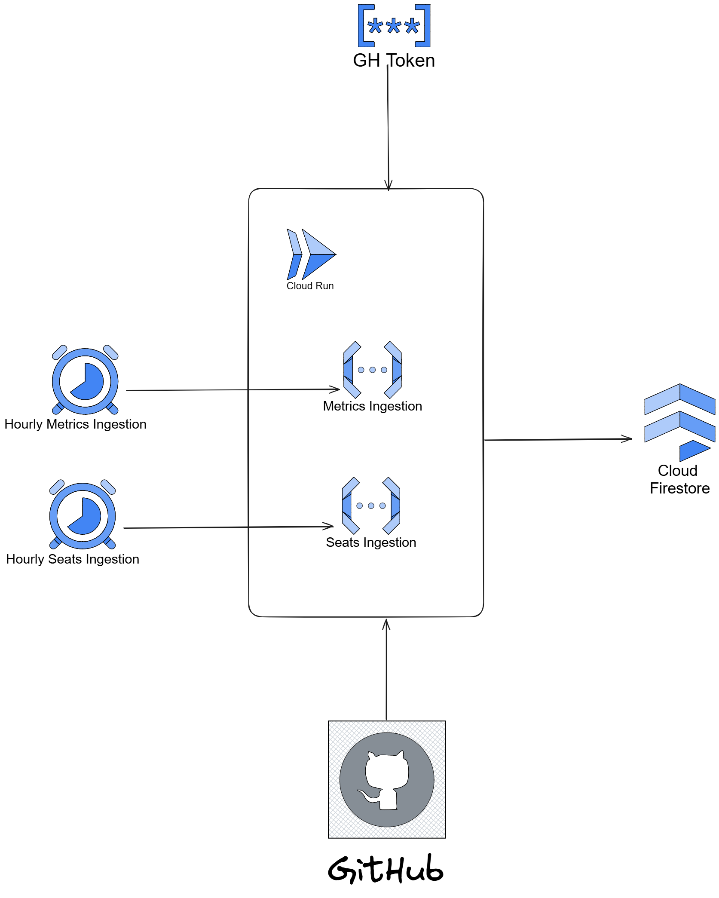

# Deployment Guide
You must have `gcloud` CLI
## Create Firestore DB
1. Create db

```bash
gcloud firestore databases create --database={db_name} --location={region}
```
region: __us-central1__

2. Create index

```bash
gcloud firestore indexes composite create --database={db_name} --collection-group=metrics_history --field-config=field-path="team_data,order=ascending" --field-config=field-path="date,order=ascending" --field-config=field-path="name,order=ascending"
```

## Create GH secret
### Windows
```bash
$secret = "s3cr3t"
$secret | Set-Content -NoNewline -Path secret.txt
gcloud secrets create {gh-secret} --data-file=secret.txt
rm secret.txt
```
### Linux
```bash
printf "s3cr3t" | gcloud secrets create {gh-secret} --data-file=-
```

## Create functions
### Create env.yaml
```yaml
LOG_EXECUTION_ID: "true"
USE_LOCAL_SETTINGS: "false"
GITHUB_API_SCOPE: "organization"
METRICS_HISTORY_FIRESTORE_COLLECTION_NAME: "metrics_history"
ENABLE_SEATS_INGESTION: "true"
GITHUB_ENTERPRISE: <enterprise>
GITHUB_ORGANIZATION: <organization>
SEATS_HISTORY_FIRESTORE_COLLECTION_NAME: "seats_history"
PROJECT_ID: <projectId>
DATABASE_ID: <db_name>
GITHUB_API_VERSION: "2022-11-28"
GITHUB_METRICS_TEAMS: <teams>
```
*GITHUB_METRICS_TEAMS: '["team-copilot", "team-copilot-2"]'*

### CopilotMetricsIngestion
```bash
gcloud functions deploy {metrics_ingestion_name} --runtime dotnet8 --trigger-http --entry-point Microsoft.CopilotDashboard.DataIngestion.Functions.CopilotMetricsIngestion --region {region} --env-vars-file env.yaml --set-secrets="GITHUB_TOKEN={gh-secret}:latest" --allow-unauthenticated
```

region: __us-central1__

### CopilotSeatsIngestion
```bash
gcloud functions deploy {seats_ingestion_name} --runtime dotnet8 --trigger-http --entry-point Microsoft.CopilotDashboard.DataIngestion.Functions.CopilotSeatsIngestion --region {region} --env-vars-file env.yaml --set-secrets="GITHUB_TOKEN={gh-secret}:latest" --allow-unauthenticated
```


region: __us-central1__

## Create scheduler
### CopilotMetricsIngestion
```bash
gcloud scheduler jobs create http {hourly_metrics_ingestion} --schedule="0 * * * *" --uri={metrics_ingestion_uri} --http-method=GET --time-zone={timezone} --description="Invokes Metrics Ingestion API each hour to populate db" --location {location}
```
location: __us-central1__
*Time Zone: "America/Argentina/Buenos_Aires"*

### CopilotSeatsIngestion
```bash
gcloud scheduler jobs create http {hourly_seats_ingestion} --schedule="0 * * * *" --uri={seats_ingestion_uri} --http-method=GET --time-zone={timezone} --description="Invokes Seats Ingestion API each hour to populate db" --location {location}
```
location: __us-central1__
*Time Zone: "America/Argentina/Buenos_Aires"*

Until now the architecture looks like this:
